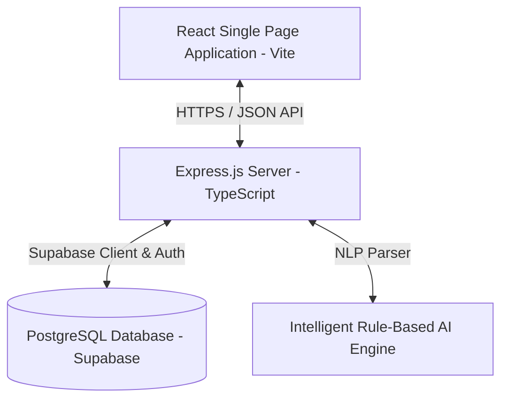
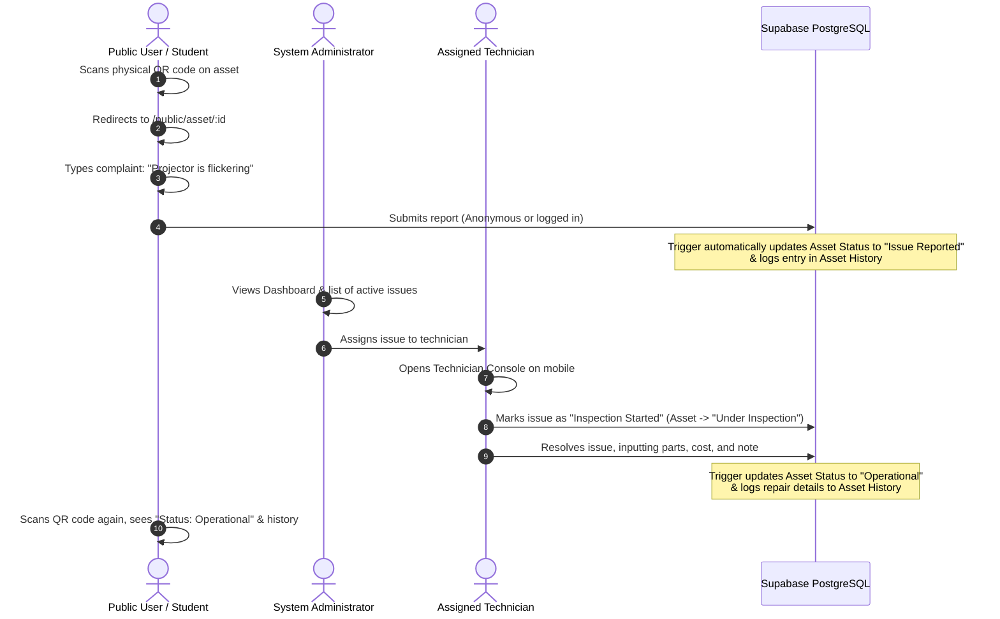

# 🛠️ MaintainIQ: AI-Powered Asset Management & Maintenance Platform

### 🔗 Quick Links
* **Repository Link**: [GitHub Repository](https://github.com/HassnainAli914/SMIT_WMA_Batch_17/tree/main/events/coding_night_hackathon-11th-july-26)
* **Live Frontend Web App (Vite + React)**: [MaintainIQ Dashboard (Vercel)](https://assets-frontend-flame.vercel.app/)
* **Live Backend API (Node + Express)**: [ServiceWala API (Vercel)](https://assets-backend-nine.vercel.app/)

---

MaintainIQ is a premium, enterprise-ready Asset Management and Facility Maintenance system designed to streamline equipment auditing, automate fault reporting, and coordinate technician workflows. By combining a modern, interactive dashboard with rule-based NLP intelligence and physical QR-code entry points, MaintainIQ minimizes equipment downtime and improves operational transparency.

---

## 🚀 Key Added Features

The platform has been enhanced with several key features that bridge the gap between administrative oversight, ground-floor technicians, and public users:

### 1. Unified Executive Analytics Dashboard
*   **Real-Time Data Visualization**: Integrated **Chart.js** canvases dynamically display key performance indicators (KPIs) such as Active Issues, Unresolved Critical Faults, Monthly Maintenance Cost trends, and Technician Assignment rates.
*   **Dynamic Asset Status Tracking**: Visual breakdown of equipment states (*Operational*, *Issue Reported*, *Under Inspection*, *Under Maintenance*, *Out of Service*, *Retired*).
*   **Priority & Category Filters**: Interactive pie and bar charts showing the breakdown of outstanding tickets by priority (*Critical*, *High*, *Medium*, *Low*) and category, allowing admins to instantly pinpoint bottlenecks.

### 2. Physical Asset Lifecycle & Audit Logging
*   **Asset Catalog (CRUD)**: Complete management panel for admins to catalog hardware, assign physical locations, specify general conditions, and allocate default technicians.
*   **QR-Code Enabled Public Portals**: Every asset has a public URL format (`/public/asset/:id`). This acts as a landing page for on-site users or students who scan physical QR codes attached to devices (e.g., projectors, AC units).
*   **Chronological Audit Logs**: Automatic trigger-based logs track all asset history (such as status updates, repair details, parts replaced, and costs) in an interactive vertical timeline.

### 3. Intelligent AI Triage & Fault Classification
*   **Natural Language Classifier**: When a user or student scans a QR code and files a report, they describe the issue in plain English (e.g., *"The AC is leaking water and blowing warm air"* or *"The projector display is flickering"*).
*   **Automatic Priority & Category Assignment**: The backend NLP engine parses keywords to automatically classify the ticket into categories (*HVAC/Electrical*, *Plumbing*, *AV/IT Hardware*, etc.) and set appropriate priority levels.
*   **Instant Safety & Inspection Guidance**: AI provides immediate action items for the reporter (e.g., *"Locate and isolate the nearest water valve"* or *"Keep clear, turn off the circuit breaker"*) and highlights dangerous conditions before a technician arrives.

### 4. Technician Operations Console
*   **Dedicated Work Interface**: A mobile-responsive layout for field engineers to view assigned tickets.
*   **One-Click Inspections**: Field agents can log findings, update the system to *Inspection Started*, and change the asset state instantly.
*   **Granular Repair Verification**: Upon resolving a ticket, technicians log specific details: work performed, parts replaced, total duration in minutes, financial cost, and secure links to photo evidence.

### 5. Multi-Role Authentication & Security (RLS)
*   **Supabase Auth Integration**: Supports secure JWT-based email/password authentication and Phone OTP login.
*   **Row-Level Security (RLS)**: Enforces strict data access rules at the database layer (e.g., only admins can manage assets, technicians can update their assigned issues, and public users can report issues).
*   **Express Security Middlewares**: Rate limiting protects authentication routes, and incoming requests are sanitized to prevent Cross-Site Scripting (XSS) or SQL Injection.

---

## 🛠️ Technology Stack

MaintainIQ utilizes a decoupled, modern architecture to achieve high performance, reliability, and ease of deployment:



### **Frontend (dashboard/)**
*   **Framework**: React 18+ bootstrapped with **Vite** for optimized assets and rapid hot module replacement.
*   **Styling**: **Tailwind CSS** providing modular layouts, animations, and typography.
*   **Charts**: **Chart.js** 3 with custom wrappers for responsive, modern graph rendering.
*   **Routing**: **React Router DOM v6** managing private/public routing and role-based route guard walls (`PrivateRoute.jsx`).
*   **Animations**: **AOS** (Animate on Scroll) for premium landing page experiences.

### **Backend (backend/)**
*   **Runtime**: **Node.js** with **TypeScript** for compile-time type safety.
*   **Framework**: **Express.js** providing a robust modular router structure.
*   **Logger**: **Winston** for structured console and file logging.
*   **Validation**: Custom schema validators ensuring request data compliance.
*   **Security**: **Helmet** (HTTP headers security), **CORS** (origin validation & whitelist), and **Express-Rate-Limit** (anti-brute force).

### **Database & Infrastructure**
*   **Engine**: **PostgreSQL** hosted via **Supabase**.
*   **SQL Schema**: Includes automated triggers (`log_asset_changes()`, `log_new_issue()`) and automated profile initialization functions written in `plpgsql`.
*   **Authentication**: Built-in Supabase Auth services.
*   **Deployment**: Configurations optimized for serverless architecture on **Vercel** (`vercel.json`).

---

## 🔄 How the Workflow Works

Here is a step-by-step example of how the platform functions:



---

## 🔮 Future Enhancements (Roadmap)

To elevate MaintainIQ into a fully autonomous, predictive facility operations platform, the following features are planned:

### 1. Real Generative AI Integration (Gemini SDK)
*   **Multimodal Asset Diagnosis**: Let technicians upload photos of broken parts (e.g., a burned out circuit board or a leaking valve) directly inside the console, using Gemini Vision to detect faults and suggest matching catalog parts.
*   **Voice-to-Text Reporting**: Enable users to record audio descriptions of issues, auto-transcribing and summarizing key symptoms.

### 2. Automatic QR Generator Utility
*   **PDF Asset Tag Generator**: Provide a tool within the Admin Dashboard to automatically generate and download sheets of print-ready QR codes for newly registered assets, complete with the MaintainIQ logo.

### 3. Real-Time Push Notifications & Alerting
*   **SMS & WhatsApp Integration**: Push instant notifications to technicians when critical tickets are assigned to them (via Twilio or WhatsApp API).
*   **Real-time Dashboard Sockets**: Upgrade the Express API routes to use PostgreSQL Real-time listeners to update graphs and lists dynamically without needing page refreshes.

### 4. Mobile Native App (React Native or Flutter)
*   **Camera Integration**: Build a native app featuring an optimized camera scanner for barcode/QR code detection.
*   **Offline Mode**: Allow technicians to read/write log checklists in basements or areas with poor cellular connection, syncing when connectivity resumes.

### 5. Preventative & Predictive Scheduling
*   **Machine-Learning Failure Intervals**: Track previous repair histories and calculate the average lifespan of specific items (e.g., bulbs, filters), auto-generating preventative maintenance tickets before a breakdown occurs.

---

## ⚙️ Running Locally

### Prerequisites
*   Node.js (v18+)
*   Supabase Account (or local PG instance)

### 1. Setup Backend
```bash
cd backend
npm install
# Copy .env.example to .env and configure variables
npm run dev
```

### 2. Setup Frontend
```bash
cd frontend-dashboard
npm install
# Copy .env.example to .env and configure VITE_API_URL
npm run dev
```
